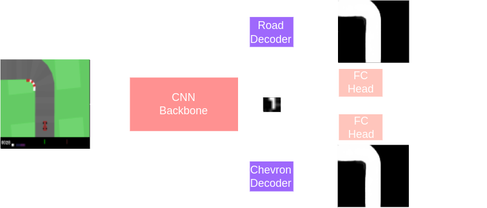

## Featured

- Path Following Controller Expert: path following controller with PID, Pure Pursuit and Stanley controller.
- Multi-task learning CNN architecture.
- DAgger for: Roll out policy and get correction from expert.

## Results

Benchmark run on 100 seeds. Experts have privileged access to world map and vehicle's pose. All PID, Pure Pursuit and Stanley Expert use a PID controller for longitudinal control and only differ on lateral steering.

<table align="center">
    <tr>
        <th>Model</th>
        <th>600 Iterations</th>
        <th>1000 Iterations</th>
    </tr>
    <tr>
        <td>PID Expert</td>
        <td>813 &plusmn; 10</td>
        <td>920 &plusmn; 27</td>
    </tr>
    <tr>
        <td>Pure Pursuit Expert</td>
        <td>745 &plusmn; 13</td>
        <td>890 &plusmn; 34</td>
    </tr>
    <tr>
        <td>Stanley Expert</td>
        <td>754 &plusmn; 15</td>
        <td>888 &plusmn; 27</td>
    </tr>
    <tr>
        <td>Baseline CNN PID Expert</td>
        <td>670 &plusmn; 220</td>
        <td>771 &plusmn; 266</td>
    </tr>
    <tr>
        <td>Multi-Task CNN Policy PID Expert</td>
        <td>790 &plusmn; 174</td>
        <td>905 &plusmn; 160</td>
    </tr>
</table>

## Demo

To run the multi-task model

```bash
python3 -m src.demo static/multi_task.pth
```

To run the baseline CNN model

```bash
python3 -m src.demo static/baseline.pth
```

## Methods

### PID Longitudinal Controller

Define desired speed $S_d$ as linear interpolation between maximal speed $S_M$ and minimal speed $S_m$, scaled by curvature $c$.

$$S_d = S_M - c\frac{(S_M - S_m)}{c_M}$$

Gas input to the car is the error between current speed and desired speed.

### PID Lateral Controller

Cross track error and heading error between reference trajectory and car are used as controller's input.

### Corner cutting

One of the most important aspect is cutting corner. Here I found two strategies:

- The first one by choosing suitable reference trajectory to compute CTE and HE. By skipping intermediate way points when the road curvature is high, the corner cutting can be achieved.

- Smooth the path with the Chaik algorithm or spline.

### Pure Pursuit Lateral Controller

Given

- Lookahead Distance $L_d$
- Current Position $x, y$
- Target Point $x_t, y_t$
- Heading Angle $\theta$
- Steering Angle $\delta$
- Wheel base $L$
Using bicycle assumption to compute the steering correction $\delta$ as

$$\alpha = \arctan\left(\frac{y_t - y}{x_t - x}\right) - \theta$$

$$\delta = \arctan\left(\frac{2L \sin(\alpha)}{L_d}\right)$$

### Stanley Lateral Controller

The Stanley controller combines cross-track error (CTE) with heading error and is a bit more robust in the theory. Since I did not spend enough time into tuning the controllers, both Pure Pursuit and Stanley Controller seems to be equal good.

### Baseline CNN Learner

<p align="center">
  
</p>

Predicts only steering and gas.

### Multi-Task Learning CNN

Extends the baseline by using the backbone's features to predict:

- **Road Mask**: Binary mask of the drivable area.
- **Curvature of the Road**: Estimation of the road's curvature.
- **Existence of Chevron Road Signs**: Detection of chevron signs indicating sharp turns.

<p align="center">
  
</p>

### Data Aggregation

Following code snippet presents the idea of DAgger.

```python
def dagger_loop(student_driver, teacher_driver, env):
    # Set up history
    history = defaultdict(list)

    # Initialize new scenario
    done = False
    observation = env.reset()
    while not done:
        state = env.get_state()
        student_action = student_driver.get_action(observation, state)
        teacher_action = teacher_driver.get_action(observation, state)
        history["input"].append((observation, state))
        observation, done = env.step(np.random.choice([teacher_action, student_action], [0.99**epoch, 1-0.99**epoch]))
        history["action"].append(teacher_action) # Store teacher's action

    # Train student on history
    student_driver.learn(history)
```
