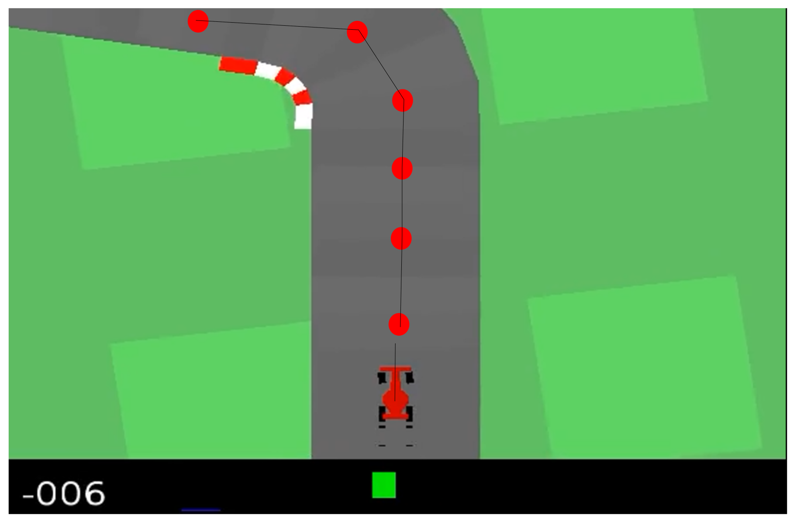

## Featured

- Path Following Controller Expert: Simple and efficient path following controller with PID, Pure Psursuit and Stanley controller.
- Multi-task learning CNN architecture.
- DAgger for Behavior Cloning: Improved performance over standard behavior cloning by incorporating corrections from the expert.

<p style="text-align: center;">
  
</p>

## Demo

The PyTorch model can be found at static.

```bash
python3 -m src.demo static/weight.pth
```

## Methods

### PID Longitudinal Controller

Define desired speed $S_d$ as linear interpolation between maximal speed $S_M$ and minimal speed $S_m$, scaled by curvature $c$.

$$S_d = S_M - c\frac{(S_M - S_m)}{c_M}$$

Gas input to the car is the error between current speed and desired speed.

### PID Lateral Controller

Cross track error and heading error between reference trajectory and car are used as controller's input. The image below show the way points (red points) and reference trajectory.

<p style="text-align: center;">
  
</p>

### Corner cutting

One of the most important aspect is cutting corner. Here I found two strategies:
- The first one by choosing suitable reference trajectory to compute CTE and HE. By skipping intermediate way points when the road curvature is high, the corner cutting can save a little time and improve the algorithm by $\sim$ 50 points.
<p style="text-align: center;">
  
</p>

- Smooth the path with the Chaik algorithm or spline. This did not work well.

### Pure Pursuit Lateral Controller
Given
- Lookahead Distance $L_d$
- Current Position $x, y$
- Target Point $x_t, y_t$
- Heading Angle $\theta$
- Steering Angle $\delta$
- Wheel base $L$
Using bicycle assumption to compute the steering correction $\delta$ as
$$\alpha = \arctan\left(\frac{y_t - y}{x_t - x}\right) - \theta$$
$$\delta = \arctan\left(\frac{2L \sin(\alpha)}{L_d}\right)$$

### Stanley Lateral Controller
The Stanley controller combines cross-track error (CTE) with heading error and is a bit more robust in the theory. Since I did not spend enough time into tuning the controllers, both Pure Pursuit and Stanley Controller seems to be equal good.

### Baseline CNN Learner
<p style="text-align: center;">
  
</p>

Predicts only steering and gas.

### Multi-Task Learning CNN

Extends the baseline by using the backbone's features to predict:
- **Road Mask**: Binary mask of the drivable area.
- **Curvature of the Road**: Estimation of the road's curvature.
- **Existence of Chevron Road Signs**: Detection of chevron signs indicating sharp turns.

### Data Aggregation

Following code snippet presents the idea of DAgger.

```python
def dagger_loop(student_driver, teacher_driver, env):
    # Set up history
    history = defaultdict(list)

    # Initialize new scenario
    done = False
    observation = env.reset()
    while not done:
        state = env.get_state()
        student_action = student_driver.get_action(observation, state)
        teacher_action = teacher_driver.get_action(observation, state)
        history["input"].append((observation, state))
        observation, done = env.step(np.random.choice([teacher_action, student_action], [0.99**epoch, 1-0.99**epoch]))
        history["action"].append(teacher_action) # Store teacher's action

    # Train student on history
    student_driver.learn(history)
```
