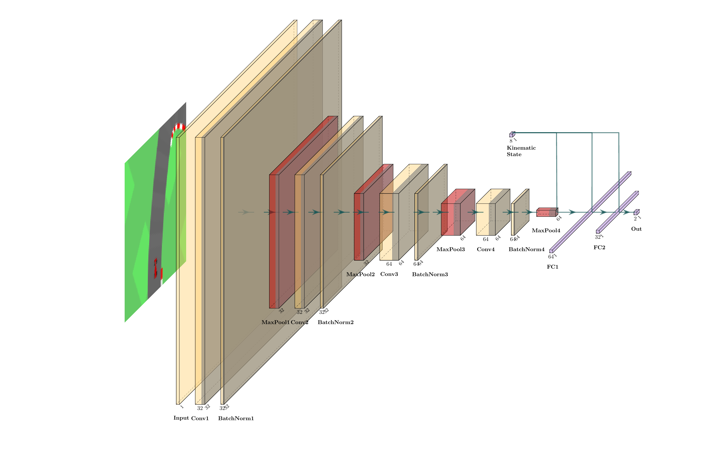

<h1 align="center">
    Solving OpenAI Gym CarRace-v2 with Imitation Learning
</h1>

<p align="center">
  
</p>

## Table of content
- [Table of content](#table-of-content)
- [Description 🔥](#description-)
  - [Drivers](#drivers)
  - [Challenges](#challenges)
- [Results 🔥](#results-)
  - [Original Challenge within 1000 Steps](#original-challenge-within-1000-steps)
    - [Experts](#experts)
    - [End-To-End Models](#end-to-end-models)
  - [Short Challenge within 600 Steps](#short-challenge-within-600-steps)
    - [Experts](#experts-1)
    - [End-To-End Models](#end-to-end-models-1)
- [Demo 🔥](#demo-)
- [Project's Structure](#projects-structure)


## Description 🔥

### Drivers

There are two kinds of drivers implemented in this project. Expert drivers and imitative drivers.

**Expert drivers have privileged accesses to a noise-free world map, vehicle's pose and kinematic state.**

- Path-following experts:
  - Linear PID controller.
  - Geometric controllers: Pure Pursuit & Stanley controller.
- Reinforcement Learning experts: Work in progress.

**On the other hand, imitative drivers only have accesses to a noisy bird-eye-view and kinematic states of the car.**

- CNN architecture with a single head outputs control prediction.
- CNN architecture with multiple heads for regularized representation learning: Work in progress.

### Challenges

Imitative drivers are benchmarked on two different challenges:

- Original challenge of OpenAI CarRacing-v0, which defined "solving" as getting average reward of 900 over 100 consecutive trials. Each trial can run at most **1000 steps**.
- Short challenge of University Tübingen, which defined "solving" as getting average reward of 700 over 100 consecutive trials. Each trial can run at most **600 steps**.

## Results 🔥

### Original Challenge within 1000 Steps

Since there is much time in this challenge, ego should drive more conservatively and try to visit every tile. Models which ace at this challenge are typically slower and don't tend to corner.

#### Experts

<table align="center">
    <tr>
        <th>Experts</th>
        <th>Mean</th>
        <th>Min</th>
        <th>Max</th>
    </tr>
    <tr>
        <td>PID</td>
        <td>920 &plusmn; 27</td>
        <td>778</td>
        <td>944</td>
    </tr>
    <tr>
        <td>Pure Pursuit</td>
        <td>896 &plusmn; 29</td>
        <td>815</td>
        <td>945</td>
    </tr>
    <tr>
        <td>Stanley</td>
        <td>882 &plusmn; 37</td>
        <td>732</td>
        <td>944</td>
    </tr>
</table>
<br>

#### End-To-End Models

<table align="center">
    <tr>
        <th>Architecture</th>
        <th>Mean</th>
        <th>Min</th>
        <th>Max</th>
        <th>Expert</th>
        <th>% Expert</th>
        <th>Solved</th>
        <th>Weights</th>
        <th>Parameters</th>
    </tr>
    <tr>
        <td>Single Head</td>
        <td>914 &plusmn; 43</td>
        <td>699</td>
        <td>948</td>
        <td>PID</td>
        <td>99%</td>
        <td>✅</td>
        <td><a href="https://api.wandb.ai/artifactsV2/default/long-pollehn1/QXJ0aWZhY3Q6MTI0NzA2MjE1Mg%3D%3D/cc6ab49df899db4b3e401d65be82dd77/2024_09_24_cgpool1904_14_55_44_SingleTaskCNN131_822.pth">weight.pth</a></td>
        <td>191k</td>
    </tr>
</table>

### Short Challenge within 600 Steps

Since time is sparse is this challenge, models which solve this challenge tend to drive faster, riskier and skip more corners.

#### Experts

<table align="center">
    <tr>
        <th>Experts</th>
        <th>Mean</th>
        <th>Min</th>
        <th>Max</th>
    </tr>
    <tr>
        <td>PID</td>
        <td>801 &plusmn; 10</td>
        <td>536</td>
        <td>944</td>
    </tr>
    <tr>
        <td>Pure Pursuit</td>
        <td>744 &plusmn; 98</td>
        <td>533</td>
        <td>945</td>
    </tr>
    <tr>
        <td>Stanley</td>
        <td>737 &plusmn; 114</td>
        <td>391</td>
        <td>994</td>
    </tr>
</table>

#### End-To-End Models

<table align="center">
    <tr>
        <th>Architecture</th>
        <th>Mean</th>
        <th>Min</th>
        <th>Max</th>
        <th>Expert</th>
        <th>% Expert</th>
        <th>Solved</th>
        <th>Weights</th>
        <th>Parameters</th>
    </tr>
    <tr>
        <td>Single Head</td>
        <td>801 &plusmn; 125</td>
        <td>259</td>
        <td>949</td>
        <td>PID</td>
        <td>100%</td>
        <td>✅</td>
        <td><a href="https://api.wandb.ai/artifactsV2/default/long-pollehn1/QXJ0aWZhY3Q6MTIzNzkyNTQ1Nw%3D%3D/94050699f17a1171a1b1a3b4e470ebba/2024_09_20_cgpool1902_10_10_01_SingleTaskCNN125_822.pth">weight.pth</a></td>
        <td>191k</td>
    </tr>
</table>

## Demo 🔥

To drive with the model

```bash
python3 -m src.demo 2024_09_20_cgpool1902_10_10_01_SingleTaskCNN125_822.pth
```

To benchmark the PID expert within 600 steps

```bash
python3 -m src.record --student_controller pid --teacher_controller pid --max_steps 600
```

To benchmark the PID expert within 1000 steps

```bash
python3 -m src.record --student_controller pid --teacher_controller pid --max_steps 1000
```

To benchmark imitator within 600 steps

```bash
python3 -m src.record --student_controller imitation --student_model_path 2024_09_20_cgpool1902_10_10_01_SingleTaskCNN125_822.pth --teacher_controller pid --max_steps 600
```

To benchmark imitator within 1000 steps

```bash
python3 -m src.record --student_controller imitation --student_model_path 2024_09_24_cgpool1904_14_55_44_SingleTaskCNN131_822.pth --teacher_controller pid --max_steps 1000
```


For controller debugging

```bash
python3 -m src.replay.replay --record_path <path> --outputp_dir <path> --plot_all_frames
```

The last script will produce a replay of the model comparing with ground truth expert's decisions.

<p align="center">
  
</p>

## Project's Structure
- `src`:
  - `conf`: Configuration directory for parameters and paths.
    - `pid_conf.py`: PID driver consists of 4 sub-drivers. The parameters in this file decides which driver will take the steering, based on curvatures.
    - `pid_extras`: Profilse of the 4 PID sub-drivers.
  - `expert_drivers`: Code for expert drivers.
    - `pid_driver`: the most important driver.
  - `imitation_driver`: Code for training imitation drivers.
    - `training`: Training module, start with `train.py`.
    - `hyperopt`: Hyper-parameter optimization module.
  - `replay`: Code for producing visualization of closed-loop simulation.
  - `utils`: Mostly small util code. Most important file is `simulator.py`.
  - `demo.py`: Demo starter code.
  - `record.py`: Code for benchmarking and debugging. Controllers running here will produce state outputs which can be used for replay, training.
