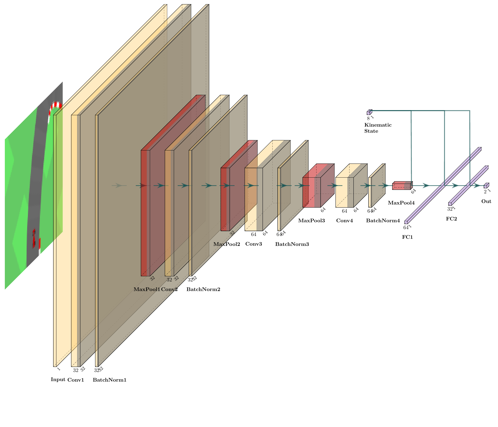

<h1 align="center">
    Solving OpenAI Gym CarRace-v2 with Imitation Learning
</h1>

<p align="center">
  
</p>

## Table of content
- [Table of content](#table-of-content)
- [Featured](#featured)
- [Results 🔥](#results-)
    - [Expert Results](#expert-results)
    - [Imitators Results](#imitators-results)
- [Demo 🔥](#demo-)
- [Methods](#methods)
  - [PID Longitudinal Controller](#pid-longitudinal-controller)
  - [PID Lateral Controller](#pid-lateral-controller)
  - [Corner cutting](#corner-cutting)
  - [Pure Pursuit Lateral Controller](#pure-pursuit-lateral-controller)
  - [Stanley Lateral Controller](#stanley-lateral-controller)
  - [Single-Task CNN Imitator](#single-task-cnn-imitator)
  - [Multi-Task Learning CNN Imitator](#multi-task-learning-cnn-imitator)
  - [Data Aggregation](#data-aggregation)


## Featured

This project explores various concepts of deep learning in general, with a focus on imitation learning. In essence, the imitators learn to drive under the supervision of experts.

<b>These experts have all privileged accesses to a noise-free world map, vehicle's pose and state. Imitators have only accesses to a noisy bird-eye-view and state of the car </b>. Under this assumption the expert's performance is an upper bound of the imitators.

As an overview, following drivers are available:
- Path-Following experts:
  - Linear PID controller.
  - Geometric controllers: Pure Pursuit & Stanley controller.
- Imitation Model:
  - Single-task CNN model with only control prediction heads.
  - Multi-task learning CNN architecture for regularized representation learning.

For training of the imitators, DAgger was employed to iron out accumulated errors of imitator.

## Results 🔥

Benchmarks were run on 100 random fixed seeds. CarRacing-v0 defines "solving" as getting average reward of 900 over 100 consecutive trials, each trial runs at most 1000 iterations.

#### Expert Results

<table align="center">
  <caption>Max 600 Iterations</caption>
    <tr>
        <th>Experts</th>
        <th>Mean</th>
        <th>Min</th>
        <th>Max</th>
    </tr>
    <tr>
        <td>PID</td>
        <td>801 &plusmn; 10</td>
        <td>536</td>
        <td>944</td>
    </tr>
    <tr>
        <td>Pure Pursuit</td>
        <td>744 &plusmn; 98</td>
        <td>533</td>
        <td>945</td>
    </tr>
    <tr>
        <td>Stanley</td>
        <td>737 &plusmn; 114</td>
        <td>391</td>
        <td>994</td>
    </tr>
</table>
<br>
<table align="center">
  <caption>Max 1000 Iterations</caption>
    <tr>
        <th>Experts</th>
        <th>Mean</th>
        <th>Min</th>
        <th>Max</th>
    </tr>
    <tr>
        <td>PID</td>
        <td>920 &plusmn; 27</td>
        <td>778</td>
        <td>944</td>
    </tr>
    <tr>
        <td>Pure Pursuit</td>
        <td>896 &plusmn; 29</td>
        <td>815</td>
        <td>945</td>
    </tr>
    <tr>
        <td>Stanley</td>
        <td>882 &plusmn; 37</td>
        <td>732</td>
        <td>944</td>
    </tr>
</table>

Note that only little time was spent on tuning the pure pursuit and stanley controllers, or on the experts in general. Tetter gain can be expected with more tuning.

#### Imitators Results

<table align="center">
  <caption>Max 600 Iterations</caption>
    <tr>
        <th>Architecture</th>
        <th>Mean</th>
        <th>Min</th>
        <th>Max</th>
        <th>Expert</th>
        <th>% of Expert</th>
    </tr>
    <tr>
        <td>Single-Task CNN</td>
        <td>770 &plusmn; 256</td>
        <td>256</td>
        <td>949</td>
        <td>PID</td>
        <td>96%</td>
    </tr>
    <tr>
        <td>Multi-Task CNN</td>
        <td>753 &plusmn; 180</td>
        <td>244</td>
        <td>948</td>
        <td>PID</td>
        <td>94  %</td>
    </tr>
</table>
<br>
<table align="center">
  <caption>Max 1000 Iterations</caption>
    <tr>
        <th>Architecture</th>
        <th>Mean</th>
        <th>Min</th>
        <th>Max</th>
        <th>Expert</th>
        <th>% of Expert</th>
    </tr>
    <tr>
        <td>Single-Task CNN</td>
        <td>861 &plusmn; 161</td>
        <td>216</td>
        <td>949</td>
        <td>PID</td>
        <td>93%</td>
    </tr>
    <tr>
        <td>Multi-Task CNN</td>
        <td>846 &plusmn; 173</td>
        <td>204</td>
        <td>948</td>
        <td>PID</td>
        <td>91%</td>
    </tr>
</table>

## Demo 🔥

Download the best trained weights

<table align="center">
    <tr>
        <td>Model</td>
        <td>Links</td>
        <td>Test time parameters</td>
    </tr>
    <tr>
        <td>Multi-Task CNN</td>
        <td><a href="https://api.wandb.ai/artifactsV2/default/long-pollehn1/QXJ0aWZhY3Q6MTIzNjAzODMyNQ%3D%3D/3508ff190c4b1b425fa7a7150647b42c/2024_09_19_cgpool1903_01_01_05_MultiTaskCNN_814.pth">2024_09_19_cgpool1903_01_01_05_MultiTaskCNN_814.pth</a></td>
        <td>200k</td>
    </tr>
    <tr>
        <td>Single-Task CNN</td>
        <td><a href="https://api.wandb.ai/artifactsV2/default/long-pollehn1/QXJ0aWZhY3Q6MTIzNTEzNDM3Ng%3D%3D/89091bbbc142d25e0a53850ca2ad2e4d/2024_09_18_cgpool1908_22_58_35_SingleTaskCNN_818.pth">2024_09_18_cgpool1908_22_58_35_SingleTaskCNN_818.pth</a></td>
        <td>200k</td>
    </tr>
</table>

To run the models

```bash
python3 -m src.demo <path_to_weight.pth>
```

## Methods

### PID Longitudinal Controller

Define desired speed $S_d$ as linear interpolation between maximal speed $S_M$ and minimal speed $S_m$, scaled by curvature $c$ of the reference trajectory.

$$S_d = S_M - c\frac{(S_M - S_m)}{c_M}$$

Gas input to the car is the error between current speed and desired speed.

### PID Lateral Controller

One PID controller for cross track error and and one controller for the heading error between reference trajectory and car.

When the standard deviation of the four wheels' rotatory speed is too high, the desired speed will be reduced. This step is crucial to avoid oversteering.

### Corner cutting

One of the most important aspect is cutting corner. Here I found two strategies:

- The first one by choosing suitable reference trajectory to compute CTE and HE. By skipping intermediate way points when the road curvature is high, the corner cutting can be achieved.

- Smooth the path with the Chaik algorithm or spline.

### Pure Pursuit Lateral Controller

Given

- Lookahead Distance $L_d$.
- Current Position $x, y$.
- Target Point $x_t, y_t$.
- Heading Angle $\theta$.
- Steering Angle $\delta$.
- Wheel base $L$.

Using bicycle assumption to compute the steering correction $\delta$ as

$$\alpha = \arctan\left(\frac{y_t - y}{x_t - x}\right) - \theta$$

$$\delta = \arctan\left(\frac{2L \sin(\alpha)}{L_d}\right)$$

### Stanley Lateral Controller

The Stanley controller combines cross-track error (CTE) with heading error and is a bit more robust in the theory. Since I did not spend enough time into tuning the controllers, both Pure Pursuit and Stanley Controller seems to be equal good.

Note the PID, Pure Pursuit, and Stanley experts all use a PID controller for longitudinal control, differing only in their lateral steering methods.

### Single-Task CNN Imitator

This baseline network predicts only steering and gas outputs and consists of almost 190,000 parameters. Heuristical binary search was used to determine the optimal number of parameters.

### Multi-Task Learning CNN Imitator

Extends the baseline by using the backbone's features to predict:

- Road segmentation: Predicting a binary mask of the drivable area.
- Curvature: Estimation of the road's curvature.
- Existence of Chevron signs: Binary prediction of existence of chevron signs, which indicate sharp turns.

This architecture consists of about 500,000 parameters in training and have the same number of parameters as the Single-Task CNN at test time.

### Data Aggregation

Following code snippet presents the idea of DAgger.

```python
def dagger_iteration(student_driver, teacher_driver, env):
    history = defaultdict(list)

    done = False
    observation = env.reset()
    while not done:
        state = env.get_state()
        student_action = student_driver.get_action(observation, state)
        teacher_action = teacher_driver.get_action(observation, state)
        history["input"].append((observation, state))
         # Roll out randomly either student's action or teacher's action.
        observation, done = env.step(np.random.choice([teacher_action, student_action], [0.99**epoch, 1-0.99**epoch]))
        history["action"].append(teacher_action) # Store only teacher's action.
    return history

# Training loop
data = []
for _ in range(epochs):
    data += dagger_iteration(student_driver, teacher_driver, env)
    student_driver.learn(data) # Learn from data
```

To accelerate the training, the student model doesn't learn from all states. Some small tricks were employed to make DAgger faster. In each epoch, namely
- only most recent data and a portion of random states are used for gradient descent. Otherwise the training
time per epoch would increase quadratically.
- roll out with too high rewards will be discarded.
- states with higher losses have higher priority.

DAgger (red in the figure) over-performs simple behavior cloning (green in the figure) by a huge margin.

<p align="center">
  
</p>
